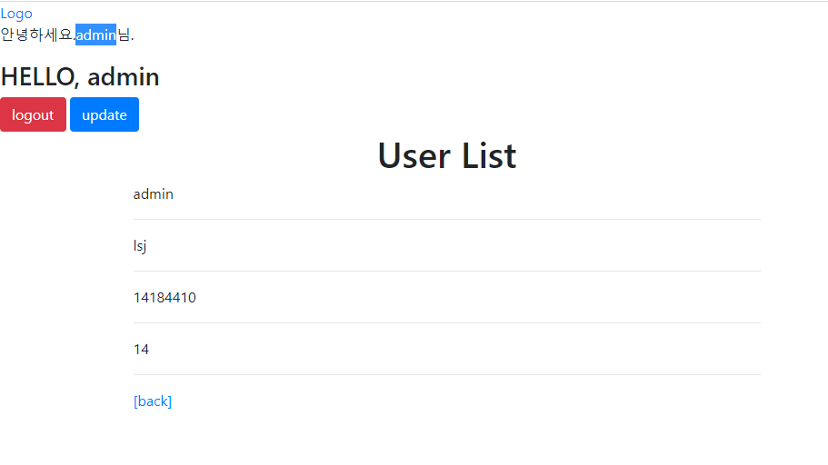
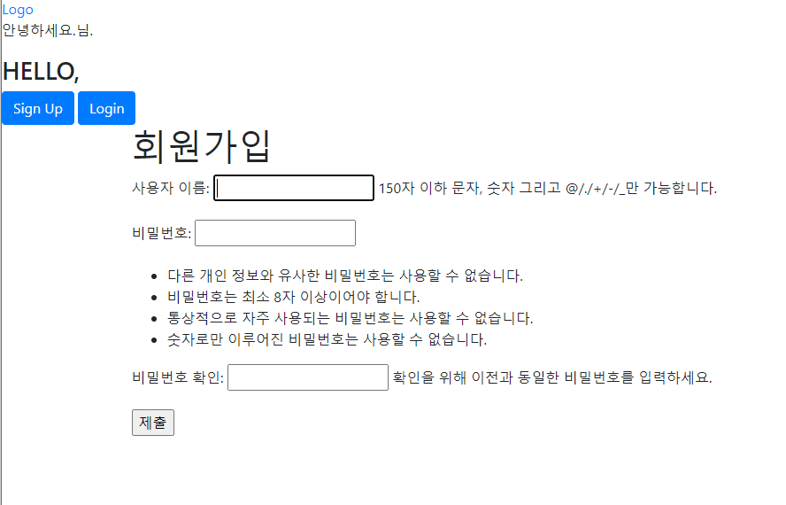

# 0916_Workshop

### 1. /accounts/

> 유저 목록을 출력하는 페이지를 나타낸다.

```python
from django.contrib.auth import get_user_model


def users(request):
    # 모든 객체 받아오기
    user_list = get_user_model().objects.all()
    # context에 저장하고 html파일에서 for문으로 출력
    context = {
        'user_list': user_list,
    }
    print(context)
    return render(request, 'accounts/users.html', context)

```



### 2. /accounts/signup/

```python
from django.contrib.auth.forms import UserCreationForm


def signup(request):

    # 로그인된 유저는 접근하지 못하게 방어하기
    # (is_authenticated는 True/False를 반환합니다.)
    if request.user.is_authenticated:
        return redirect('articles:index')

    if request.method == 'POST':
        form = UserCreationForm(request.POST)
        if form.is_valid():
            # password를 처음으로 암호화 하는 시기(save로 저장시)
            form.save()
            return redirect('articles:index')
    else:
        form = UserCreationForm()    
    context = {
        'form': form,
    }
    return render(request, 'accounts/signup.html', context)
```

