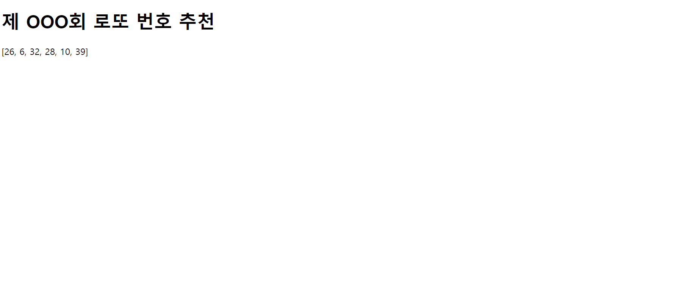

# 0814_workshop


### 제 000회 로또 번호 추천

1. intro/urls.py

   ```python
   from django.contrib import admin
   from django.urls import path
   from pages import views
   
   urlpatterns = [
       path('admin/', admin.site.urls),
       path('lotto/', views.lotto),
   ]
   ```

2. pages/views.py

   ```python
   import random
   from django.shortcuts import render
   
   # Create your views here.
   
   def lotto(request):
       numbers = range(1,46)
       nums = random.sample(numbers,6)
       context = { 
           'nums' : nums
       }
       
       return render(request, 'lotto.html', context)
   ```

   

3. templates/lotto.html

   ```html
   <!DOCTYPE html>
   <html lang="en">
   <head>
     <meta charset="UTF-8">
     <meta name="viewport" content="width=device-width, initial-scale=1.0">
     <title>Document</title>
   </head>
   <body>
       <p>ssafy님께서 선택하신 로또 번호는 {{nums}}입니다.</p>
   </body>
   </html>
   ```

4. 결과 사진

   