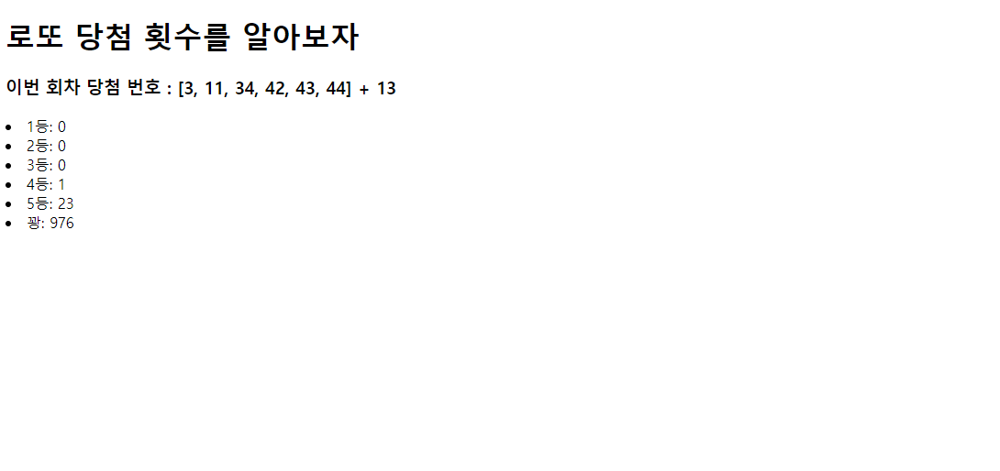

# 0818_practice




1. pratice/urls.py

   ```python
   from django.contrib import admin
   from django.urls import path
   from pages import views
   
   
   urlpatterns = [
       path('lotto/',views.lotto),
       path('admin/', admin.site.urls),
   ]
   
   ```

   

   

2. practice/views.py

   ```python
   from django.shortcuts import render
   import requests
   import random
   # Create your views here.
   def random_num(number):
       set1 = set(number[:6])
       # print(set1)
       lotto = range(1,46)
       grade = {'1등': 0 ,'2등':0 ,'3등':0, '4등':0 ,'5등': 0, '꽝': 0}
       for _ in range(1000):    
           my_number = random.sample(lotto, 6)
           my_number.sort()
           set2 = set(my_number)
           inter = set1 & set2
           if len(inter) == 6:
               grade['1등'] +=1
           elif len(inter) == 5:
               if number[6] in my_number:
                   grade['2등'] +=1
               else:
                   grede['3등'] +=1
           elif len(inter) == 4:
               grade['4등'] +=1
           elif len(inter) == 3:
               grade['5등'] +=1
           else:
               grade['꽝'] +=1    
       return grade
   def lotto(request):
       #이번 회차 924
       url = 'https://www.dhlottery.co.kr/common.do?method=getLottoNumber&drwNo=924' 
       response = requests.get(url).json()
       number= []
      
       
       for i in range(1,7):
           text= 'drwtNo' + str(i)
           number.append(response.get(text))
       number.sort()
       number.append(response.get('bnusNo'))
       context = random_num(number)
       context['this'] = number[:6]
       context['bns'] = number[6]
   
       return render(request, 'lotto.html', context)templates/lotto.html
   ```

   3.templates/lotto.html

   ```python
   <!DOCTYPE html>
   <html lang="en">
   <head>
     <meta charset="UTF-8">
     <meta name="viewport" content="width=device-width, initial-scale=1.0">
     <title>Document</title>
   </head>
   <body>
     <h1>로또 당첨 횟수를 알아보자 </h1>
   
     <h3>이번 회차 당첨 번호 : {{this}} + {{bns}}</h3>
     <li>1등: {{ 1등 }}</li>
     <li>2등: {{ 2등 }}</li>
     <li>3등: {{ 3등 }}</li>
     <li>4등: {{ 4등}}</li>
     <li>5등: {{ 5등}}</li>
     <li>꽝: {{ 꽝 }}</li>
   </body>
   </html>
   
   ```

   