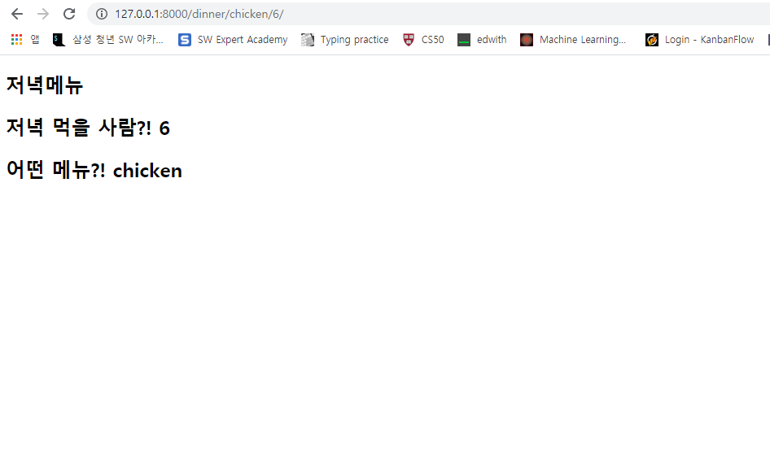

# 0818_workshop



1. intro/urls.py

   ```python
   from django.contrib import admin
   from django.urls import path
   from pages import views
   
   urlpatterns = [
       path('dinner/<str:menu>/<int:x>/', views.dinner),
       path('admin/', admin.site.urls),
   ]
   ```

2. pages/views/py

   ```python
   from django.shortcuts import render
   
   # Create your views here.
   
   
   def dinner(request, menu, x):
       context = {
           'menu' : menu,
           'x' : x
       }
       return render(request, 'dinner.html', context)
   ```

   

3. templates/dinner.html

   ```html
   <!DOCTYPE html>
   <html lang="en">
   <head>
     <meta charset="UTF-8">
     <meta name="viewport" content="width=device-width, initial-scale=1.0">
     <title>Document</title>
   </head>
   <body>
     <h2>저녁메뉴</h2>
     <h2>저녁 먹을 사람?! {{ x}}</h2>
     <h2>어떤 메뉴?! {{menu}} </h2>
   </body>
   </html>
   ```

   