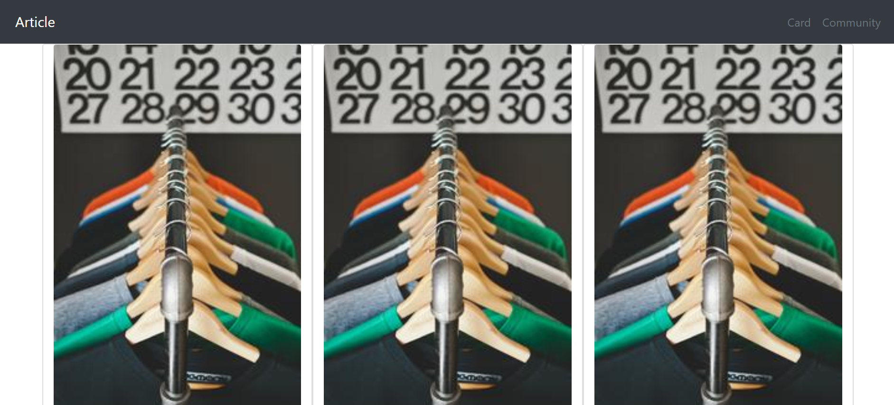
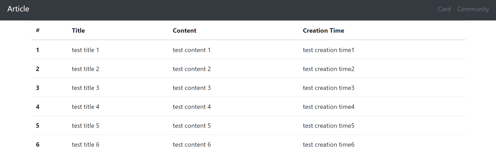

# 0819_workshop

### 결과






1. intro/settings.py 

```python

INSTALLED_APPS = [
    'pages',
    'django.contrib.admin',
    'django.contrib.auth',
    'django.contrib.contenttypes',
    'django.contrib.sessions',
    'django.contrib.messages',
    'django.contrib.staticfiles',
]

MIDDLEWARE = [
    'django.middleware.security.SecurityMiddleware',
    'django.contrib.sessions.middleware.SessionMiddleware',
    'django.middleware.common.CommonMiddleware',
    'django.middleware.csrf.CsrfViewMiddleware',
    'django.contrib.auth.middleware.AuthenticationMiddleware',
    'django.contrib.messages.middleware.MessageMiddleware',
    'django.middleware.clickjacking.XFrameOptionsMiddleware',
]

ROOT_URLCONF = 'intro.urls'

TEMPLATES = [
    {
        'BACKEND': 'django.template.backends.django.DjangoTemplates',
        'DIRS': [BASE_DIR / 'intro' / 'templates'],
        'APP_DIRS': True,
        'OPTIONS': {
            'context_processors': [
                'django.template.context_processors.debug',
                'django.template.context_processors.request',
                'django.contrib.auth.context_processors.auth',
                'django.contrib.messages.context_processors.messages',
            ],
        },
    },
]
```


2. intro/urls.py 

```python
from django.contrib import admin
from django.urls import path
from pages import views
urlpatterns = [
    path('card/',views.card),
    path('community/',views.community),
    path('admin/', admin.site.urls),
]
```


3. pages/views.py 

```python
from django.shortcuts import render

# Create your views here.
def card(request):
    articles = [
    ['test title1', 'test content1'],
    ['test title2', 'test content2'],
    ['test title3', 'test content3'],
    ['test title4', 'test content4'],
    ['test title5', 'test content5'],
    ]
    context = {
        'articles' : {
        articles[0][0] : articles[0][1],
        articles[1][0] : articles[1][1],
        articles[2][0] : articles[2][1],
        articles[3][0] : articles[3][1],
        articles[4][0] : articles[4][1],
        }
    }
    return render(request, 'card.html', context)


def community(request):
    articles = [
    ['#', 'Title', 'Content', 'Creation Time'],
    ['test title 1', 'test content 1', 'test creation time1'],
    ['test title 2', 'test content 2', 'test creation time2'],
    ['test title 3', 'test content 3', 'test creation time3'],
    ['test title 4', 'test content 4', 'test creation time4'],
    ['test title 5', 'test content 5', 'test creation time5'],
    ['test title 6', 'test content 6', 'test creation time6'],
    ]
    context = {
        'key' : articles[0],
        'titles' : articles[1:], 
    }
    return render(request, 'community.html', context)
```


4. intro/templates/base.html

```html
<!DOCTYPE html>
<html lang="en">
<head>
  <meta charset="UTF-8">
  <meta name="viewport" content="width=
  , initial-scale=1.0">
  <link rel="stylesheet" href="https://stackpath.bootstrapcdn.com/bootstrap/4.5.2/css/bootstrap.min.css" integrity="sha384-JcKb8q3iqJ61gNV9KGb8thSsNjpSL0n8PARn9HuZOnIxN0hoP+VmmDGMN5t9UJ0Z" crossorigin="anonymous">
  <title> 
  </title>
</head>
<body>
  
  
  <div class = "container">
    
    <!-- content 이름은 아무거나 .. -->

    
  </div>
  <script src="https://code.jquery.com/jquery-3.5.1.slim.min.js" integrity="sha384-DfXdz2htPH0lsSSs5nCTpuj/zy4C+OGpamoFVy38MVBnE+IbbVYUew+OrCXaRkfj" crossorigin="anonymous"></script>
  <script src="https://cdn.jsdelivr.net/npm/popper.js@1.16.1/dist/umd/popper.min.js" integrity="sha384-9/reFTGAW83EW2RDu2S0VKaIzap3H66lZH81PoYlFhbGU+6BZp6G7niu735Sk7lN" crossorigin="anonymous"></script>
  <script src="https://stackpath.bootstrapcdn.com/bootstrap/4.5.2/js/bootstrap.min.js" integrity="sha384-B4gt1jrGC7Jh4AgTPSdUtOBvfO8shuf57BaghqFfPlYxofvL8/KUEfYiJOMMV+rV" crossorigin="anonymous"></script>
</body>
</html>
```


5. pages/templates/card.html 

```html

  

    <nav class="navbar navbar-expand-lg navbar-light bg-dark">
      <a class="navbar-brand text-white mr-auto p-2" href="#">Article</a>
      <button class="navbar-toggler" type="button" data-toggle="collapse" data-target="#navbarNav" aria-controls="navbarNav" aria-expanded="false" aria-label="Toggle navigation">
        <span class="navbar-toggler-icon"></span>
      </button>
      <div class="collapse navbar-collapse d-flex justify-content-end" id="navbarNav">
        <ul class="navbar-nav">
          <li class="nav-item">
            <a class="nav-link text-secondary" href="http://127.0.0.1:8000/card/">Card</a>
          </li>
          <li class="nav-item">
            <a class="nav-link text-secondary" href="http://127.0.0.1:8000/community/">Community</a>
          </li>
        </ul>
      </div>
    </nav>



  <div class="row">
    
    <div class="card col-4" style="width: 18rem;">
    
    <div class="card-body">
     
      <h5 class="card-title">{{x}}</h5>
      <p class="card-text">{{y}}</p>

      <a href="#" class="btn btn-primary">Post Article</a>
    </div>

  </div>
  
  </div>

```


6. pages/templates/community.html

```html

  

    <nav class="navbar navbar-expand-lg navbar-light bg-dark">
      <a class="navbar-brand text-white mr-auto p-2" href="#">Article</a>
      <button class="navbar-toggler" type="button" data-toggle="collapse" data-target="#navbarNav" aria-controls="navbarNav" aria-expanded="false" aria-label="Toggle navigation">
        <span class="navbar-toggler-icon"></span>
      </button>
      <div class="collapse navbar-collapse d-flex justify-content-end" id="navbarNav">
        <ul class="navbar-nav">
          <li class="nav-item">
            <a class="nav-link text-secondary" href="http://127.0.0.1:8000/card/">Card</a>
          </li>
          <li class="nav-item">
            <a class="nav-link text-secondary" href="http://127.0.0.1:8000/community/">Community</a>
          </li>
        </ul>
      </div>
    </nav>




  <table class="table">
  <thead>
    <tr>
      
        <th scope="col">{{ k }}</th>
      
    </tr>
  </thead>
  <tbody>
   
    <tr>
        <th scope="row">{{forloop.counter}}</th>
        
        <td>{{t}}</td>
        
        
    </tr>
  </tbody>
</table>

```

