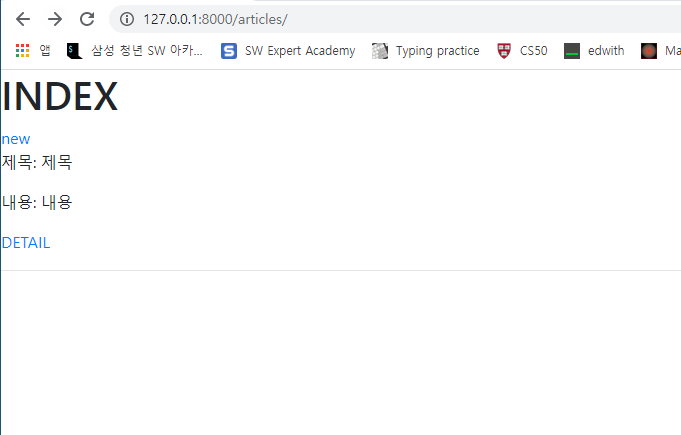
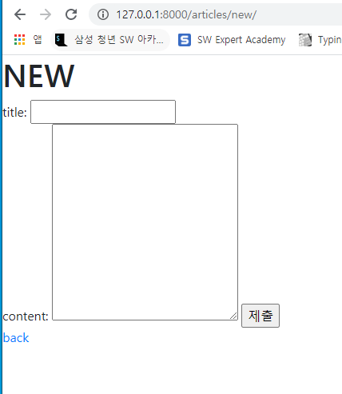
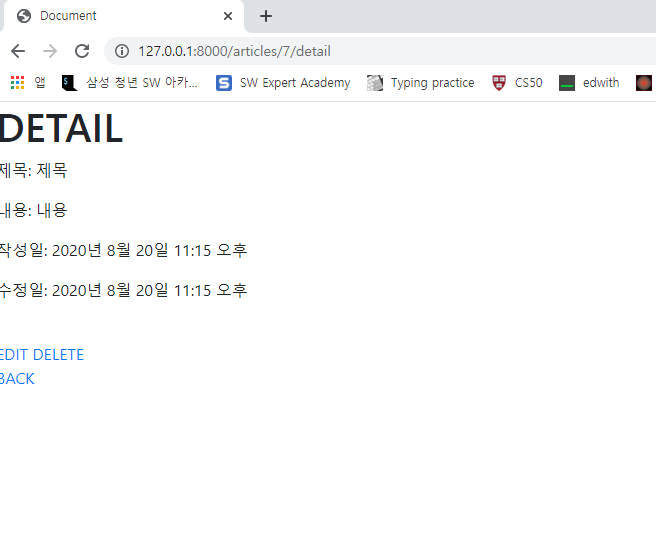
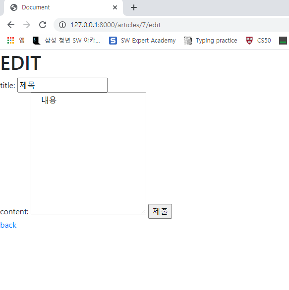

# 0820_workshop

 

#### 결과사진











1.  models.py

```python
from django.db import models

# Create your models here.
class Article(models.Model):
    title = models.CharField(max_length=10)
    content = models.TextField()
    create_at = models.DateTimeField(auto_now_add=True)
    update_at = models.DateTimeField(auto_now=True)

```

2. base.html

```python
<!DOCTYPE html>
<html lang="en">
<head>
  <meta charset="UTF-8">
  <meta name="viewport" content="width=device-width, initial-scale=1.0">
  <link rel="stylesheet" href="https://stackpath.bootstrapcdn.com/bootstrap/4.5.2/css/bootstrap.min.css" integrity="sha384-JcKb8q3iqJ61gNV9KGb8thSsNjpSL0n8PARn9HuZOnIxN0hoP+VmmDGMN5t9UJ0Z" crossorigin="anonymous">
  <title>Document</title>
</head>
<body>    
  
  

  <script src="https://code.jquery.com/jquery-3.5.1.slim.min.js" integrity="sha384-DfXdz2htPH0lsSSs5nCTpuj/zy4C+OGpamoFVy38MVBnE+IbbVYUew+OrCXaRkfj" crossorigin="anonymous"></script>
  <script src="https://cdn.jsdelivr.net/npm/popper.js@1.16.1/dist/umd/popper.min.js" integrity="sha384-9/reFTGAW83EW2RDu2S0VKaIzap3H66lZH81PoYlFhbGU+6BZp6G7niu735Sk7lN" crossorigin="anonymous"></script>
  <script src="https://stackpath.bootstrapcdn.com/bootstrap/4.5.2/js/bootstrap.min.js" integrity="sha384-B4gt1jrGC7Jh4AgTPSdUtOBvfO8shuf57BaghqFfPlYxofvL8/KUEfYiJOMMV+rV" crossorigin="anonymous"></script>
</body>
</html>
```


3. urls.py

```python
from django.urls import path
from . import views


app_name = 'articles'
urlpatterns = [
    path('',views.index, name="index"),
    path('new/', views.new, name="new"),
    path('create/',views.create, name="create"),
    path('<int:article_pk>/detail', views.detail, name = "detail"),
    path('<int:article_pk>/edit', views.edit, name = "edit"),
    path('<int:article_pk>/update', views.update, name = "update"),
    path('<int:article_pk>/delete', views.delete, name = "delete"),
]
```


4. views.py

```python
from django.shortcuts import render, redirect
from .models import Article


# Create your views here.
def index(request):
    articles = Article.objects.all()
    context = {
        'articles' : articles
    }
    return render(request, 'articles/index.html', context)


def new(request):
    return render(request,'articles/new.html')


def create(request):
    title = request.POST.get('title')
    content = request.POST.get('content')

    article = Article()
    article.title = title
    article.content = content
    article.save()
    return redirect('articles:detail', article.pk)


def detail(request, article_pk):
    article = Article.objects.get(pk = article_pk)
    context ={
        'article' : article
    }
    return render(request, 'articles/detail.html', context)


def edit(request, article_pk):
    article = Article.objects.get(pk = article_pk)
    context ={
        'article' : article
    }
    return render(request, 'articles/edit.html', context)


def update(request, article_pk):
        #1. 
    title = request.POST.get('title')
    content = request.POST.get('content')
    #2.
    article = Article.objects.get(pk = article_pk)
    #3. 수정 및 저장
    article.title = title
    article.content = content
    article.save()
    return redirect('articles:detail', article_pk)

def delete(request,article_pk):
    article = Article.objects.get(pk = article_pk)
    article.delete()
    return redirect('articles:index')
```

5.  index.html

```python



  <h1>INDEX</h1>
  <a href="">new</a>
  <br>
  
    <p>제목: {{article.title}}</p>
    <p>내용: {{article.content}}</p>
    <a href="">DETAIL</a>
    <hr>
  

```


6. new.html

```python



  <h1>NEW</h1>
  <form action="" method ="POST">
  
    title: <input type="text" name = 'title'>
    <br>
    content: <textarea name="content" id="" cols="30" rows="10">
    </textarea>
    <input type="submit">
  </form>
  <a href="">back</a>

```


7. edit.html

```python



  <h1>EDIT</h1>
  <form action="" method ="POST">
  
    title: <input type="text" name = 'title' value = {{article.title}}>
    <br>
    content: <textarea name="content" id="" cols="30" rows="10">
    {{article.content}}
    </textarea>
    <input type="submit">
  </form>
  <a href="">back</a>

```


8. detail.html

```python


  <h1>DETAIL</h1>
  <p>제목: {{article.title}}</p>
  <p>내용: {{article.content}}</p>
  <p>작성일: {{article.create_at}}</p>
  <p>수정일: {{article.update_at}}</p>
  <br>
  <a href="">EDIT</a>
  <a href="">DELETE</a>
  <br>
  <a href="">BACK</a>


```