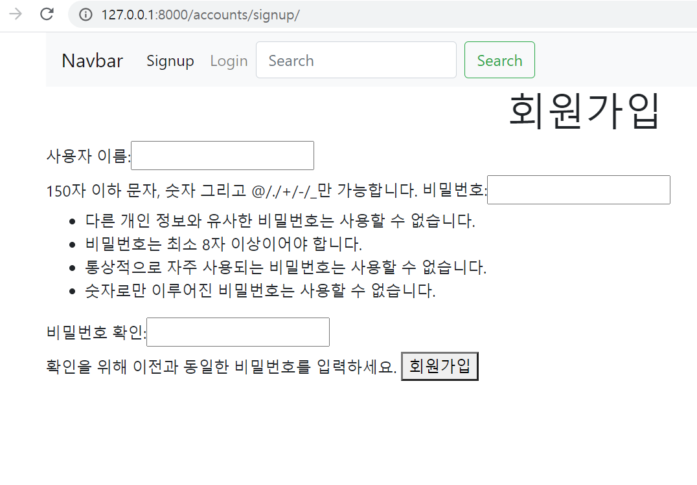
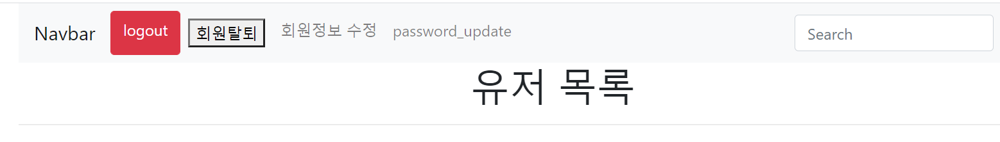
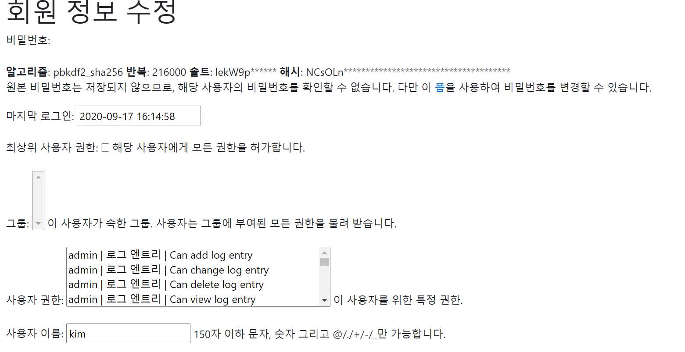

# 0917_Practice


### 1. User Create

```python 
# views.py 
def signup(request):
    if request.method == 'POST':
        form = UserCreationForm(request.POST)
        if form.is_valid():
            form.save()
            # request 객체에 메세지 추가하기 
            messages.add_message(request, messages.SUCCESS, 'Congratuation~!')
            return redirect('accounts:user_list')
    else:
        form = UserCreationForm()
    context = {
        'form': form,
    }
    return render(request, 'accounts/signup.html', context)
```



### 2. Login

```python
# login
def login(request):
    if request.method == 'POST':
        form = AuthenticationForm(request, request.POST)
        if form.is_valid():
            # 세션을 생성해서 데이터베이스에 저장한다 == 로그인.
            user = form.get_user()
            auth_login(request, user)
            return redirect('accounts:user_list')
    
    else:
        form = AuthenticationForm()
    context = {
        'form': form,
    }
    return render(request, 'accounts/login.html', context)
```



### 3. Logout

```python

def logout(request):
    auth_logout(request)
    return redirect('accounts:user_list')
```


### 4. User Update

```python
@login_required 
def update(request):
    # UserChangeForm
    if request.method =='POST':
        form = CustomUserChangeForm(request.POST, instance = request.user)
        if form.is_vaild():
            forms.save()
            return redirect('account:user_list')
    else:
        form = CustomUserChangeForm(instance = request.user)
        # request.user은 어노이머스 유저를 커버를 못함 -> @login_required 
    context ={
        'form' : form,
    }
    return render(request, 'accounts/update.html',context)
```




### 5. User Delete

```python
@require_POST
def delete(request): # 
    request.user.delete() # 
    return redirect('accounts:user_list')
```

