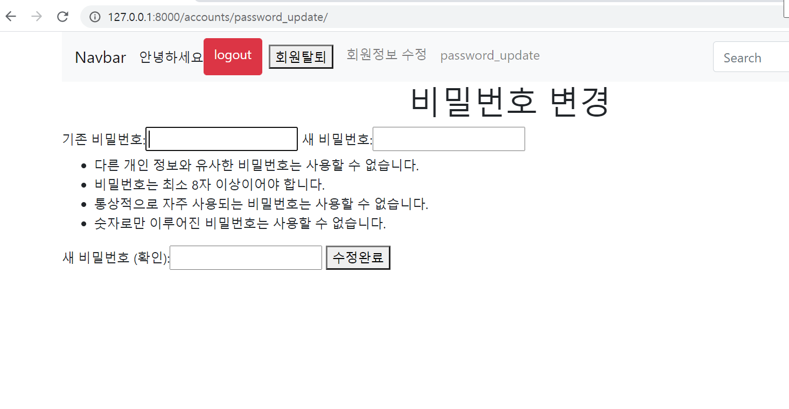

# 0917_workshop

### 1. Password Change

```python
@login_required
def password_update(request):
    if request.method == 'POST':
        form = PasswordChangeForm(request.user, request.POST)
        if form.is_valid():
            user = form.save() # 새로운 password 저장
            update_session_auth_hash(request, user) # 암호 변경 시 세션 무효화 방지
            messages.add_message(request, messages.SUCCESS, 'success~!')
            return redirect('accounts:user_list')
    else:
        form = PasswordChangeForm(request.user)
    context = {
        'form': form,
    }
    return render(request, 'accounts/password_update.html', context)
```

