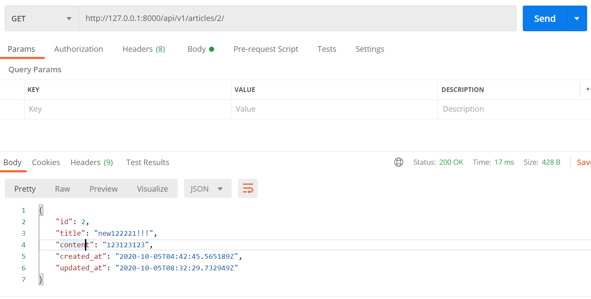
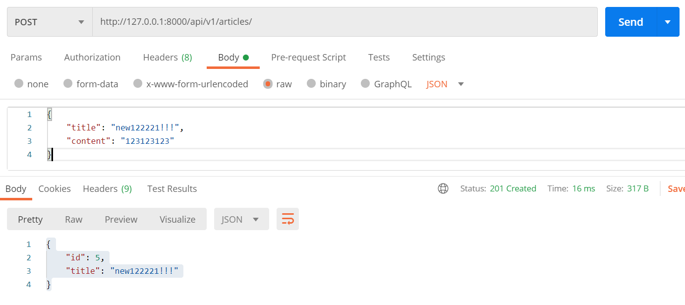
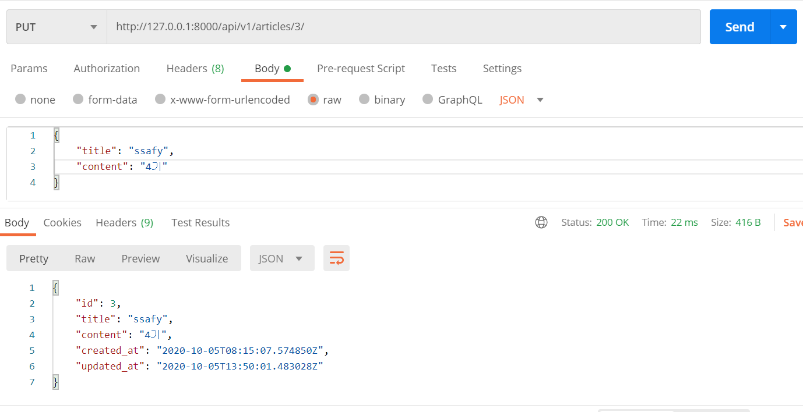
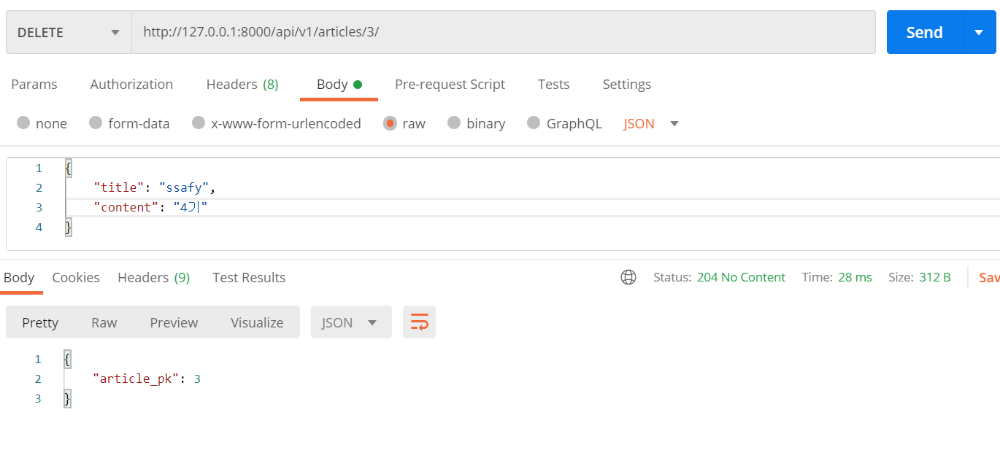

# 1005_WorkShop


### 1.  views.py

```python
from django.shortcuts import render, get_object_or_404
from .models import Article
from .serializers import (
    ArticleListSerializer,
    ArticleSerializer,
)
from rest_framework import status # 프로페셔널하게~
from rest_framework.decorators import api_view
from rest_framework.response import Response
# Create your views here.
@api_view(['GET', 'POST'])
def article_list(request):
    # 1. get이라면
    if request.method == 'GET':
        # 1. 데이터베이스에 있는 모든 게시글을 가져온다.
        articles = Article.objects.all()
        # 2.Serializers으로 전송가능한 JSON으로 바꿔준다.
        serializer = ArticleListSerializer(articles, many = True) 
        # 두번째인자: 넘기는 데이터 종류가 2개 이상이면 해주기
        # 3. 마지막으로 Response 함수를 이용하여 반환 
        return Response(data = serializer.data)

    # 2. POST
    elif request.method == 'POST':
        # json 파일을 파이썬 데이터 타입으로 변환
        serializer = ArticleListSerializer(data = request.data)
        if serializer.is_valid(raise_exception=True): # 유효하지 않은 데이터있때는 
            serializer.save()
            return Response(data = serializer.data, status=status.HTTP_201_CREATED) 
        # 그대로 보내주기

@api_view(['GET', 'PUT', 'DELETE'])
def article_detail(request, article_pk):
    article = get_object_or_404(Article, pk=article_pk)
    
    if request.method == 'GET':
        serializer = ArticleSerializer(article) # JSON
        return Response(serializer.data)

    elif request.method == 'PUT':
        serializer = ArticleSerializer(instance=article, data=request.data)
        if serializer.is_valid(raise_exception=True):
            serializer.save()
            return Response(serializer.data)

    elif request.method == 'DELETE':
        article.delete()
        data = {
            'article_pk': article_pk,
        }
        return Response(data, status=status.HTTP_204_NO_CONTENT)
```


### 2. serializers.py

```python
from rest_framework import serializers
from .models import Article
class ArticleListSerializer(serializers.ModelSerializer):
    '''
    시리얼라이저를 사용하는 이유
    1. 데이터베이스에서 가져온 쿼리셋을 JSON으로 바꿔서 응답해주기 위해
    2. 요청으로 받아온 JSON 형태의 데이터를 반대로 파이썬 객체로 만들어서 저장하기 위해
    '''
    class Meta:
        model = Article
        fields = ('id', 'title')
# 개별 게시글별 시리얼라이저
class ArticleSerializer(serializers.ModelSerializer):
    class Meta:
        model = Article
        fields = ('id', 'title', 'content', 'created_at', 'updated_at')
```


----

#### GET




#### POST



#### PUT



#### DELETE

